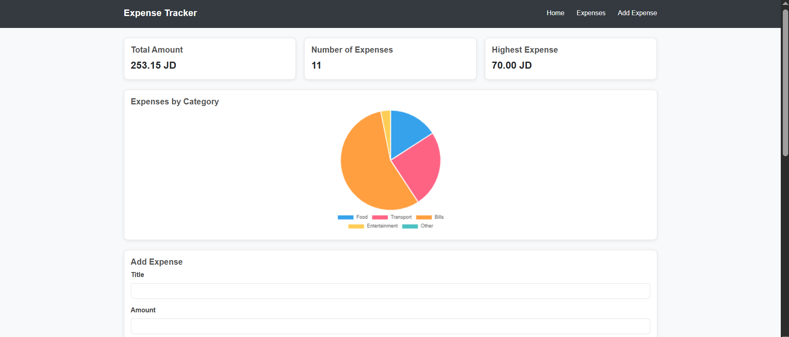
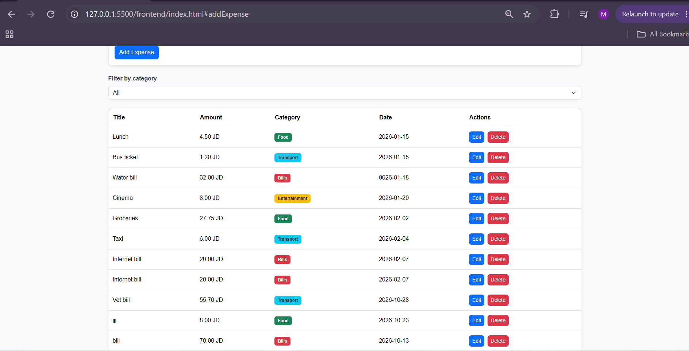
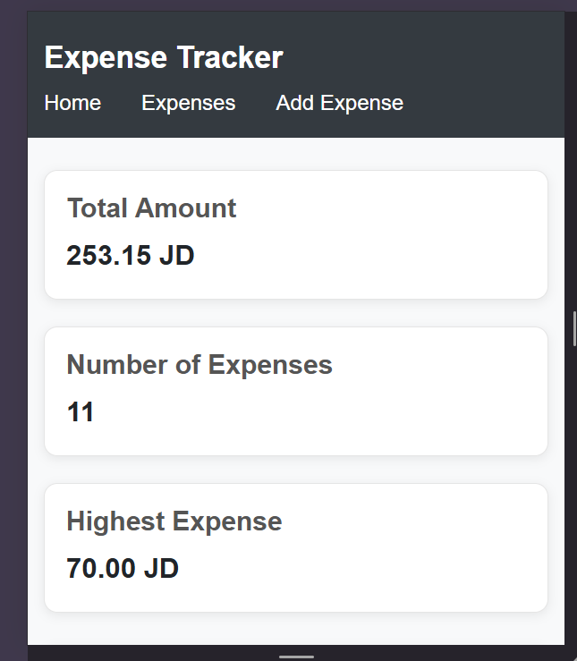
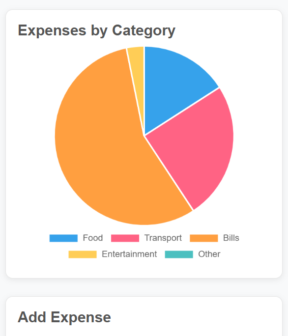
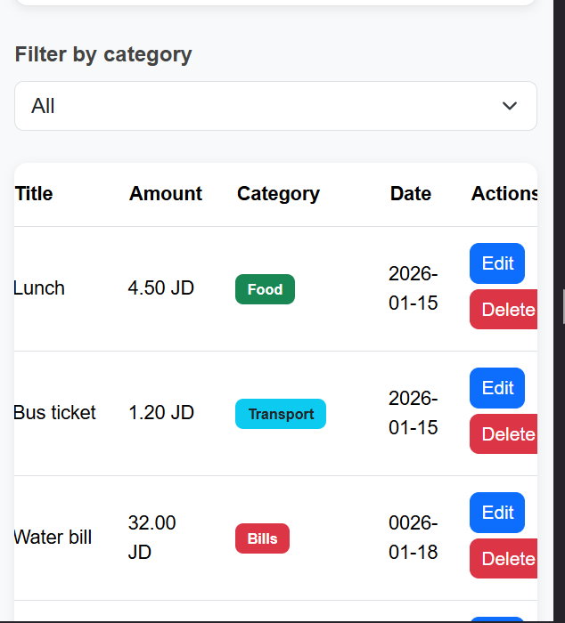

# Expense Tracker

A full-stack web app for recording personal expenses. You can add, edit, delete and filter expenses, and see a summary and a category chart. Everything is stored in a PostgreSQL database.

- **GitHub repo:** [YOUR-REPO-LINK](YOUR-REPO-LINK)
- **Demo:** [https://drive.google.com/file/d/1svN3CAfJYMwpO3Ep3w1GB5mBwithP24F/view?usp=sharing](https://drive.google.com/file/d/1svN3CAfJYMwpO3Ep3w1GB5mBwithP24F/view?usp=sharing)

## How to run

Requirements: Node.js, PostgreSQL and VS Code (with the **Live Server** extension).

**Backend**

1. Open a terminal in the project folder and go into the backend folder:
   ```bash
   cd backend
   ```
2. Create the database in pgAdmin: right-click **Databases** → **Create** → **Database**, name it `expense_tracker`, and click **Save**.
3. Create the tables by running `schema.sql`: right-click the `expense_tracker` database → **Query Tool**, open `backend/schema.sql` (folder icon), and click **Run** (▶).
4. Create a file named `.env` inside the `backend` folder with your own values:
   ```env
   DB_HOST=localhost
   DB_PORT=5432
   DB_USER=postgres
   DB_PASSWORD=your_password
   DB_NAME=expense_tracker
   PORT=3000
   ```
5. Install the dependencies:
   ```bash
   npm install
   ```
6. Start the server:
   ```bash
   node server.js
   ```
   The API now runs at `http://localhost:3000`. Keep this terminal open.

**Frontend**

1. Open the project folder in VS Code.
2. Right-click `frontend/index.html` and choose **Open with Live Server**.
3. The app opens in your browser at `http://127.0.0.1:5500/frontend/index.html`. Make sure the backend is running first, otherwise no data will load.

## Features

- [x] Add an expense (with validation)
- [x] Delete an expense
- [x] Edit an expense
- [x] Filter by category
- [x] Summary cards (total, count, highest)
- [x] Data is saved in a PostgreSQL database
- [x] Pie chart of expenses by category
- [x] Responsive layout (desktop and mobile)

## Screenshots

**Desktop**




**Mobile**





## What was the hardest part?

The hardest part was understanding how the frontend talks to the backend. To make it clearer, I split my frontend JavaScript into three files, each with one job: one file for the UI (drawing the table, cards and chart on the page), one file for the API calls (sending requests to the backend and returning the responses), and one main app file that connects them. When the user clicks something, the app file decides what to do, calls the API file to send the request to the backend, and then tells the UI file to update the page with the result. Once each part had a single responsibility, the flow from click to database and back became much easier to follow and debug.
